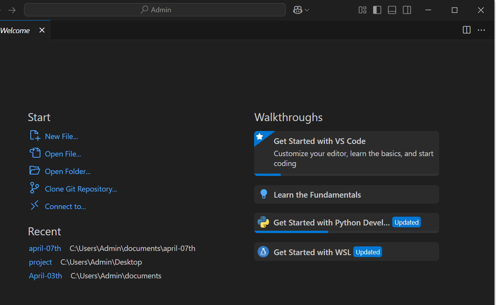

# TECHENVIROMENTSETUP

This document outlines the setup of the tech environment, including the Visual Studio Code welcome screen, Git installation confirmation, Oracle VirtualBox Manager welcome screen, Ubuntu login prompt in VirtualBox, GitHub user account setup, and AWS user account setup.

## Visual Studio Code Welcome Screen

Visual Studio Code (VS Code) is an integrated development environment developed by Microsoft for Windows, Linux, macOS, and web browsers.

## Git Installation Confirmation

This confirms whether Git is properly installed on a Windows system. It can be done using Command Prompt, PowerShell, or Git Bash.

## Oracle VirtualBox Manager Welcome Screen

This shows the full welcome screen of the Oracle VirtualBox Manager.

## Ubuntu Login Prompt in VirtualBox

This section shows how the Ubuntu login prompt appears when started in VirtualBox.

## GitHub User Account Setup

This section covers the initial setup process for a GitHub user account.

## AWS User Account Setup

This outlines the setup process for an AWS user account, including the steps involved in progressing through the stages.

